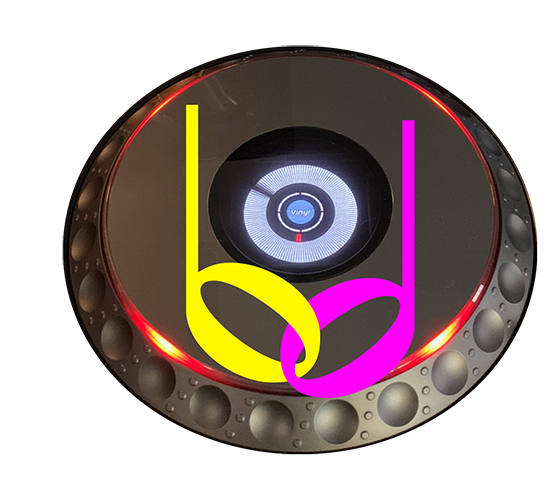

# beat-link-max

A package for hosting
[Beat Link](https://github.com/brunchboy/beat-link) inside
[Cycling ‘74’s Max](https://cycling74.com).

## Getting Help

Deep Symmetry&rsquo;s projects are generously sponsored with hosting
by <a href="https://zulip.com">Zulip</a>, an open-source modern team
chat app designed to keep both live and asynchronous conversations
organized. Thanks to them, you can <a
href="https://deep-symmetry.zulipchat.com/#narrow/stream/275322-beat-link-trigger">chat
with our community</a>, ask questions, get inspiration, and share your
own ideas.

## Usage

The beat-link-max package provides a number of objects for interacting with Beat Link.

> To be written!

## Installation

> To be written!

## Funding

Beat Link is, and will remain, completely free and open-source. If it
has helped you, taught you something, or inspired you, please let us
know and share some of your discoveries and how you are using it! If
you'd like to financially support its ongoing development, you are
welcome (but by no means obligated) to donate to offset the hundreds
of hours of research, development, and writing that have already been
invested. Or perhaps to facilitate future efforts, tools, toys, and
time to explore.

 using Liberapay, or
 using PayPal

### Contributing in Other Ways

If you have ideas, discoveries, or even code you’d like to share,
that’s fantastic! Please take a look at the
[guidelines](CONTRIBUTING.md) and get in touch!

## License

Copyright © 2024 [Deep Symmetry, LLC](http://deepsymmetry.org)

Distributed under the [Eclipse Public License
2.0](https://opensource.org/licenses/EPL-2.0). By using this software
in any fashion, you are agreeing to be bound by the terms of this
license. You must not remove this notice, or any other, from this
software. A copy of the license can be found in
[LICENSE.md](LICENSE.md) within this project.
